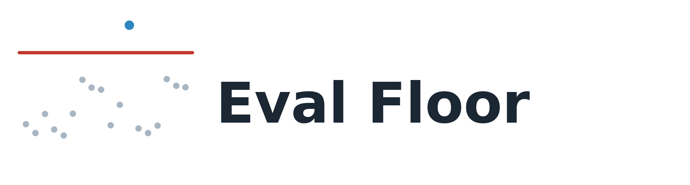
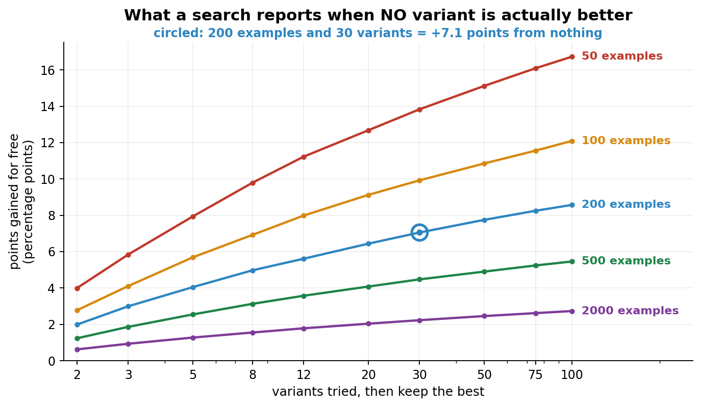

<div align="center">



# EvalFloor: is your LLM eval improvement real?

[](https://pypi.org/project/evalfloor/)
[](https://pypi.org/project/evalfloor/)
[](LICENSE)
[](https://github.com/novaleolin/evalfloor/actions)
[](pyproject.toml)

**[Quickstart](#quickstart) · [Why](#why-this-happens) · [API](#api) · [CI gate](#use-it-as-a-ci-gate) · [FAQ](#faq) · [简体中文](README.zh-CN.md)**

</div>

---

## What is EvalFloor?

When you try k variants against an eval set and keep the best score, that
score is biased upward. The maximum of k noisy measurements exceeds the true
value even when all k variants are equally good, and the bias grows with k.

EvalFloor computes that bias from the scores your tuning loop already
produced. No model, no rerun, no dependencies.

| | |
|---|---|
| **+7.0 points free** | 200 eval examples, 30 variants tried, no real difference between any of them |
| **2 functions** | `check()` for the floor, `confirm()` for a paired held-out test |
| **0 dependencies** | no model, no API key, no rerun. It reads scores you already have |
| **Catches both errors** | when a gain is fake, and when your split is too small to say |

## Quickstart

```bash
pip install evalfloor
```

You tried 30 prompts and kept the best one. The score went 0.62 to 0.69.

```python
import evalfloor
print(evalfloor.check(scores=my_30_scores, n_examples=200))
```

```
  baseline              0.620
  best                  0.685   apparent gain +0.065
  selection floor       +0.069   <- a 30-candidate search scores this much on pure noise
  best, de-biased       0.616

  BELOW THE FLOOR: a search this size reports at least this much on data
                   with no real differences at all
```

All 30 prompts in this example have the same true accuracy. The 6.5 point
gain is sampling error, and it falls under the floor.

```bash
python3 examples/quickstart.py     # 30 seconds, no downloads, no API key
```

Runs two tuning sessions. In the first, all 30 variants have the same true
accuracy. In the second, one variant is 8 points better. Both report a gain.

## Why this happens

Each score is an estimate measured on a finite eval set, so each carries
sampling error. Taking the maximum selects for positive error. Trying more
variants raises the expected maximum.



| eval set | 5 tries | 10 tries | 30 tries | 100 tries |
| ---: | ---: | ---: | ---: | ---: |
| 50 | +8.0 | +10.4 | +13.9 | +16.8 |
| 100 | +5.6 | +7.5 | +10.0 | +12.1 |
| **200** | +4.1 | **+5.3** | **+7.0** | +8.6 |
| 500 | +2.6 | +3.4 | +4.5 | +5.5 |
| 2000 | +1.3 | +1.7 | +2.2 | +2.7 |

At 200 examples and 30 variants the floor is +7.0 points.

### Floors for benchmarks you already use

Accuracy points a search gains when no variant is actually better
(`python3 tools/benchmark_floors.py`):

| benchmark | items | 10 tries | 30 tries | 100 tries |
| :--- | ---: | ---: | ---: | ---: |
| **AIME 2025** | **30** | **+13.1** | **+17.6** | **+21.9** |
| MT-Bench | 80 | +7.7 | +10.1 | +12.2 |
| HumanEval | 164 | +5.1 | +6.7 | +8.1 |
| GPQA Diamond | 198 | +5.4 | +7.2 | +8.9 |
| MBPP | 378 | +3.6 | +4.7 | +5.8 |
| Arena-Hard | 500 | +3.5 | +4.6 | +5.6 |
| SWE-bench Verified | 500 | +3.4 | +4.5 | +5.5 |
| GSM8K | 1319 | +1.5 | +2.0 | +2.4 |
| MMLU (full) | 14042 | +0.6 | +0.8 | +1.0 |

AIME has 30 problems. Trying 30 prompts against it and keeping the best
scores +17.6 points with no real improvement at all. MMLU at 14042 items
gives +0.8, which is why the same tuning habit is safe there and not here.


## Usage

### `check`: how much of your best score is luck

```python
evalfloor.check(scores, n_examples)          # scores = every variant you tried
```

`scores` must contain every variant you evaluated, not just the winner. The
floor depends on how many were tried.

### `confirm`: does the winner hold up on data it wasn't chosen on

```python
evalfloor.confirm(baseline_correct, winner_correct)   # per-example, True/False
```
```
  held-out   13 fixed / 3 broken   sign test p=0.0213
  CONFIRMED: the winner is better on data it was not selected on
```

It also tells you when you simply don't have enough data:

```
  held-out   5 fixed / 0 broken   sign test p=0.0625
  UNDERPOWERED: every disagreement favours the winner (5-0), but 5 of them
                cannot reach p<0.05: the floor for 5 pairs is 0.0625. Your
                held-out split is too small to settle this.
```

An exact sign test over `d` disagreements cannot return a p-value below
`2^(1-d)`, so five or fewer can never reach 0.05. `confirm()` reports this as
UNDERPOWERED rather than as a negative result.

### `staged_floor`: for staged evaluation

Score every candidate on a small set, promote the survivors to a larger one,
report the best:

```python
evalfloor.staged_floor(stages=[(10, 0.0), (60, 0.40), (200, None)],
                       k=30, p=0.20, nested=True)
```
```
  selection floor       +0.110

  the reported best came from:
    stage 2:   60 examples, promote above 40%      100%
    stage 3:  200 examples                           0%

  Your headline number is coming from the 60-example stage 100% of the time.
  That is not the 200-example stage you pay for.
```

With a 40% gate and candidates at 20%, few candidates reach stage 3. The
reported maximum comes from stage 2, so the floor is +0.110 rather than the
+0.059 of a 200-example stage. A stricter gate raises the floor.

### API

```python
from evalfloor import check, confirm, selection_floor, staged_floor, eb_shrink

check(scores, n_examples, baseline=None)   # .apparent_gain .floor .shrunk .beats_floor
confirm(baseline_hits, new_hits)           # .wins .losses .p_value .confirmed .underpowered
selection_floor(k, n, p)                   # points a k-candidate search gets free
staged_floor(stages, k, p, nested=False)   # same, for staged loops
eb_shrink(scores, n)                       # de-biased best
```

## Schema optimizer (optional)

```bash
pip install "evalfloor[local]"
evalfloor mydata.jsonl --kind choice --metric exact
```

Searches over a typed decision schema: instruction text, option
descriptions, which fields go into the state, and thresholds. Every run
prints its own floor and held-out test. The default backend is a local
model, so no API key is needed.

```bash
python3 examples/banking77_intent.py    # ticket routing
python3 examples/rag_relevance.py       # keep-or-drop retrieved passages
```

Ticket routing, real output:

```
  winner   (train)          0.521   apparent gain +0.083
  selection floor (null)    +0.141   <- the gain is BELOW the floor

  winner   (held-out)       0.542   real gain +0.208
  held-out paired           13 fixed / 3 broken   p=0.0213

  verdict: CREDIBLE
```

Here the train gain of +0.083 is under the floor of +0.141, so the verdict
rests on the held-out split alone.

The RAG example starts at F1 = 0.000. The scorer gives every passage 0.10 to
0.19, so the default `0.5` threshold returns an empty set. The search reaches
0.286 by lowering it.

## Use it as a CI gate

Printing a floor helps whoever reads the terminal. Wiring it into the
pipeline that produced the scores stops a result from being promoted on
noise.

```bash
python -m evalfloor.gate --scores 0.62 0.65 0.69 --n 200
python -m evalfloor.gate results.json --json
```

Exit code 0 when the gain clears the floor, 1 when it does not, 2 on bad
input. With `--json`, stdout is one object; everything else goes to stderr.

```yaml
- name: tuning result must clear the selection floor
  run: python -m evalfloor.gate results.json
```

`results.json` takes `scores` and `n_examples`, and optionally
`baseline_hits` and `winner_hits`. When the held-out arrays are present they
decide, not the floor: the floor governs the split the search ran on, and a
held-out result was never selected on.

## Limits

`selection_floor` assumes candidates are independent, each evaluated once,
on a 0/1 metric. Correlated candidates and heavy-tailed metrics both make the
true floor higher than it reports. Staged loops use `staged_floor` instead.

All of these bias it in the same direction, so the reported floor is a lower
bound.
A gain under it is under the true floor too. A gain over it still needs
`confirm()`.

## FAQ

**I tuned my prompt 30 times and accuracy went up 5 points. Is that real?**
Probably not. At 200 eval examples the floor for 30 variants is +7.0. Run
`check()` on all 30 scores to get the floor for your own numbers.

**How is this different from a held-out set?**
A held-out set establishes that a variant is better. The floor tells you when
your scores cannot establish anything, before you spend held-out data on them.
Run `check()` first and `confirm()` on whatever survives.

**Is this just overfitting to the eval set?**
Nothing is fitted here. The bias comes from picking the largest of several
noisy scores, which is biased upward whether or not a model was trained.

**My metric isn't accuracy.**
`selection_floor` assumes a 0/1 metric. On other metrics it under-reports the floor, so
a gain under the reported floor is under the true one as well.

**My loop promotes candidates between cheap and expensive stages.**
Use `staged_floor()`. It also reports which stage the maximum came from,
which is usually not the expensive one.

**Can I use it on hyperparameter sweeps, A/B tests, model selection?**
Yes. Anything that evaluates k options and keeps the best has this bias.

MIT.
